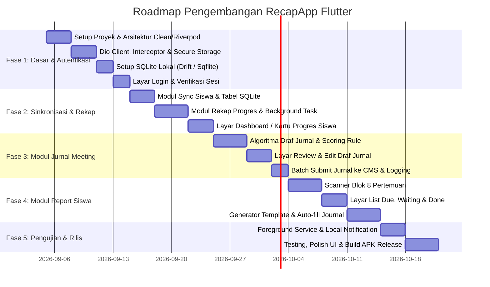

# Product Requirement Document (PRD)
# RecapApp — Android Version (Flutter)

---

## 📌 Informasi Dokumen

| Properti | Detail |
|---|---|
| **Nama Produk** | RecapApp Mobile (Android) |
| **Versi Dokumen** | 1.0.0 |
| **Tanggal Pembuatan** | 3 September 2026 |
| **Status** | Approved / Ready for Development |
| **Platform Target** | Android (Min SDK 24 / Android 7.0 Nougat, Target SDK 34/35) |
| **Framework** | Flutter (Dart ≥ 3.4) |
| **Target Pengguna** | Guru & Admin Timedoor Academy |
| **Basis Referensi** | RecapApp Web (Node.js + React 19) |

---

## 1. 🎯 Ringkasan Eksekutif & Latar Belakang

### 1.1 Latar Belakang
RecapApp versi web telah berhasil membantu guru Timedoor Academy dalam mengotomasi tugas administratif rutin di CMS (sinkronisasi data siswa, rekap progres, pembuatan jurnal *meeting*, dan pembuatan laporan evaluasi blok 8 pertemuan). 

Namun, versi web saat ini mensyaratkan komputer/laptop aktif sebagai server lokal (Node.js) atau perangkat yang terhubung ke jaringan Wi-Fi lokal yang sama. Dalam skenario riil di kelas/cabang:
- Guru sering kali mengajar berpindah ruang kelas atau mengajar secara *hybrid* tanpa membawa laptop utama.
- Guru membutuhkan fleksibilitas untuk mengecek progres siswa, memverifikasi draf jurnal, atau mengirimkan laporan berkala langsung dari *smartphone* Android mereka kapan saja dan di mana saja tanpa bergantung pada server desktop.

### 1.2 Tujuan Produk (Goals)
1. **Mobilitas Penuh**: Menyediakan aplikasi Android *standalone* tanpa memerlukan server perantara (Node.js). Aplikasi langsung berkomunikasi dengan API resmi CMS Timedoor Academy.
2. **Kemandirian Penyimpanan (Standalone Offline-First DB)**: Menggunakan basis data lokal SQLite di perangkat Android yang menyimpan profil siswa, rekapan progres, dan riwayat laporan.
3. **Paritas Fitur 100%**: Membawa seluruh fitur inti dari versi web ke perangkat bergerak:
   - Autentikasi sesi & auto-refresh token CMS.
   - Sinkronisasi daftar siswa aktif.
   - Rekapitulasi progres detail (mastery, koin, kuis).
   - Generator draf dan pengiriman jurnal *meeting* otomatis.
   - Scanner & generator laporan evaluasi blok 8 pertemuan beserta fitur *auto-fill* jurnal.
4. **Optimasi Pengalaman Pengguna (Mobile-First UX)**: Mengubah antarmuka tabel lebar web menjadi kartu interaktif (*collapsible cards* / *bottom sheets*) yang ergonomis untuk layar sentuh 5–7 inci.

---

## 2. 👥 Persona Pengguna & Use Cases

### 2.1 Persona
- **Guru Pengajar (Teacher)**:
  - Mengajar 20–50 siswa di beberapa kelas (*coding explorer*, *python*, *roblox*, dll.).
  - Sering kehabisan waktu di akhir sesi untuk mengisi jurnal *meeting* satu per satu di CMS web.
  - Perlu memantau siswa mana saja yang sudah mencapai kelipatan 8 pertemuan agar laporan (*report*) segera dibuat.
- **Koordinator Cabang / Admin**:
  - Memeriksa progres siswa secara cepat tanpa perlu membuka CMS Timedoor versi desktop yang lambat.

### 2.2 Skenario Penggunaan Utama (Use Cases)
1. **UC-01 (Quick Journaling)**: Selesai kelas, guru membuka aplikasi di HP, memilih siswa kelas hari ini, klik "Susun Draf Jurnal", meninjau catatan yang dibuat otomatis, lalu klik "Kirim ke CMS".
2. **UC-02 (Block Report Due Monitoring)**: Guru membuka tab Report, memindai blok yang *due*, memilih blok 16 yang belum dibuatkan laporan, meninjau kriteria yang otomatis terisi narasi nama siswa, lalu submit laporan langsung dari HP.
3. **UC-03 (Student Progress Lookup)**: Guru sedang berbincang dengan orang tua siswa di lobi, membuka tab Ringkasan, mencari nama siswa, dan langsung melihat progres *mastery*, koin, dan kuis terakhir secara instan dari cache lokal.

---

## 3. 🏗️ Arsitektur Teknis & Tech Stack

Aplikasi Android dibangun sepenuhnya dengan **Flutter** sebagai aplikasi *native* klien tunggal yang berkomunikasi langsung dengan backend CMS Timedoor.

```
┌────────────────────────────────────────────────────────┐
│                   Flutter UI (View)                    │
│  Material 3 · Riverpod / BLoC · Responsive Mobile UX   │
└───────────────────────────┬────────────────────────────┘
                            │
┌───────────────────────────▼────────────────────────────┐
│               State Management & Use Cases             │
│   AuthNotifier · SyncNotifier · JournalNotifier ...    │
└─────────────┬────────────────────────────┬─────────────┘
              │                            │
┌─────────────▼────────────┐ ┌─────────────▼────────────┐
│      Local Database      │ │      Remote Network       │
│  SQLite (Drift / Sqflite)│ │  Dio Client (HTTP/HTTPS)  │
│  Encrypted Token Storage │ │  - 400ms Polite Delay     │
│  (FlutterSecureStorage)  │ │  - Auto Refresh Token     │
└──────────────────────────┘ └─────────────┬─────────────┘
                                           │
                             ┌─────────────▼─────────────┐
                             │    CMS Timedoor API       │
                             │ https://cms.timedooracademy.com
                             └───────────────────────────┘
```

### 3.1 Tech Stack yang Direkomendasikan
| Komponen | Pustaka / Teknologi | Alasan Pemilihan |
|---|---|---|
| **Framework** | Flutter (Dart ≥ 3.4) | Multiplatform, performa rendering tinggi (Impeller engine), ekosistem matang. |
| **State Management** | **Flutter Riverpod** (v2.x) | Reaktif, *testable*, *compile-safe*, mudah menangani state asinkron (*AsyncValue*). |
| **HTTP Client** | **Dio** | Dukungan *interceptor* yang kuat untuk menangani *auth token*, *auto-refresh*, dan *rate limiting*. |
| **Local Database** | **Drift** (atau **Sqflite**) | SQLite lokal terenkripsi/relasional, performa tinggi, mendukung migrasi skema tabel. |
| **Secure Storage** | **flutter_secure_storage** | Menyimpan `access_token` dan `refresh_token` di Android Keystore (aman dari ekstraksi APK/root). |
| **Background Tasks** | **flutter_foreground_task** / **WorkManager** | Menjaga proses rekap/scan panjang tetap berjalan saat layar mati atau aplikasi di *minimize*. |
| **Local Notifications**| **flutter_local_notifications** | Memberikan notifikasi saat *sync*, *recap*, atau *scan* selesai di latar belakang. |
| **UI Design System** | **Material 3 (M3)** | Desain modern, adaptif dengan sistem tema Android (*Dynamic Color*, *Dark Mode*). |

---

## 4. 📋 Kebutuhan Fungsional (Functional Requirements)

### Modul 1: Autentikasi & Manajemen Sesi (FR-AUTH)

- **FR-AUTH-01 (Login CMS)**:
  - Form input Email dan Password CMS Timedoor.
  - Memanggil endpoint `/api/tms/auth/login`.
  - Jika sukses, simpan `access_token` dan `refresh_token` secara aman di *Encrypted Secure Storage*.
  - Simpan profil dasar guru (email/nama) untuk ditampilkan di antarmuka.
- **FR-AUTH-02 (Token Refresh Interceptor)**:
  - Dio *interceptor* otomatis menangkap respons HTTP `401 Unauthorized`.
  - Melakukan *token rotation* via `/api/auth/refresh-token` tanpa me-logout pengguna.
  - Jika refresh token kedaluwarsa, arahkan pengguna kembali ke layar Login dengan pesan informatif.
- **FR-AUTH-03 (Auto Login / Session Persistence)**:
  - Saat aplikasi dibuka, periksa ketersediaan token di *storage* dan panggil endpoint verifikasi sesi.
  - Tampilkan *Splash Screen* selama proses validasi.
- **FR-AUTH-04 (Logout)**:
  - Menghapus seluruh token dari *secure storage*.
  - Opsional: memberikan konfirmasi apakah ingin membersihkan basis data lokal atau mempertahankan cache siswa.

---

### Modul 2: Sinkronisasi & Manajemen Siswa (FR-SYNC)

- **FR-SYNC-01 (Sinkronisasi Data Siswa)**:
  - Mengambil daftar siswa dari `/api/tms/student?search=&limit=100&page=N` dengan penanganan *pagination* otomatis sampai halaman terakhir (`meta.last_page`).
  - Meng-upsert data ke tabel SQLite lokal `students`.
- **FR-SYNC-02 (Pencarian & Filter Cepat)**:
  - Fitur pencarian instan berdasarkan nama siswa atau kode siswa (query lokal `LIKE %q%`).
  - Filter berdasarkan jumlah sesi aktif atau status pembelajaran.
- **FR-SYNC-03 (Informasi Status Sinkronisasi)**:
  - Menampilkan waktu sinkronisasi terakhir dan jumlah total siswa terdaftar di layar.

---

### Modul 3: Rekapitulasi Progres Belajar (FR-RECAP)

- **FR-RECAP-01 (Background Recap Job)**:
  - Menjalankan iterasi per siswa: mengambil data *learning-session*, *progress-detail*, dan *meeting-history*.
  - Mematuhi **polite delay 400 ms** antar permintaan ke CMS agar tidak terkena *rate limit*.
  - Menampilkan *Linear Progress Bar* di aplikasi yang menampilkan siswa yang sedang diproses (`Siswa 12 dari 35: Budi Pratama`).
- **FR-RECAP-02 (Visualisasi Kartu Progres Siswa)**:
  - Menampilkan daftar ringkasan progres siswa dalam bentuk kartu mobile yang rapi:
    - Persentase penyelesaian kurikulum (*progress bar*).
    - Skor *mastery* yang diperoleh vs batas maksimal.
    - Jumlah koin yang terkumpul.
    - Lesson terakhir dan tanggal pertemuan terakhir.
    - Riwayat nilai kuis (*quiz scores*).
- **FR-RECAP-03 (Filter & Pengurutan)**:
  - Pengurutan berdasarkan: Nama (A-Z / Z-A), Progres Terendah/Tertinggi, Tanggal Meeting Terakhir.
  - Filter siswa yang belum memiliki data rekap.

---

### Modul 4: Pengelolaan & Pengiriman Jurnal Meeting (FR-JOURNAL)

- **FR-JOURNAL-01 (Penyusun Draf Jurnal / Plan)**:
  - Memilih satu atau semua siswa yang akan dibuatkan draf jurnal.
  - Mengambil riwayat *meeting* dan aktivitas dari CMS.
  - **Algoritma Pemisahan Blok & Carry-Over**:
    - Mendeteksi batas blok kelipatan 8 (misal lesson 8, 16, 24).
    - Membawa lesson yang belum tercatat ke pertemuan berikutnya jika melewati batas blok.
  - **Algoritma Penilaian Skor Aktivitas**:
    - Pertemuan kelipatan 8 (ujian) atau lesson ujian → skor otomatis **100**.
    - Aktivitas tanpa nilai (0) → skor otomatis **86**.
    - Aktivitas lainnya → skor adaptif `max(70, min(skor + 10, 100))`.
  - Membuat draf narasi catatan: `"{nama_siswa} mempelajari {lesson} dengan baik."`.
- **FR-JOURNAL-02 (Antarmuka Review & Edit Draf)**:
  - Menampilkan daftar draf per siswa yang siap dikirim.
  - Guru dapat mengedit isi catatan (*note*) atau mengubah nilai skor aktivitas sebelum dikirim.
  - Menampilkan daftar pertemuan yang dilewati (*skipped*) beserta alasannya (misal: sudah ada jurnal di CMS).
- **FR-JOURNAL-03 (Pengiriman Batch ke CMS)**:
  - Mengirimkan draf jurnal yang dicentang secara berurutan dengan jeda waktu aman.
  - Mencatat log status pengiriman ke tabel `journal_log` lokal.

---

### Modul 5: Sistem Pelaporan Blok 8 Pertemuan (FR-REPORT)

- **FR-REPORT-01 (Pemindai Blok Siswa / Scan Job)**:
  - Memindai seluruh siswa dan *course* aktif.
  - Melewati *book* / *course* yang sudah ditandai selesai di tabel `report_done`.
  - Menghitung lesson tertinggi (`max_lesson`) dan memetakannya ke blok 8, 16, 24, 32.
  - Mengidentifikasi status per blok:
    - `due`: Blok sudah tercapai tetapi belum ada laporan sama sekali.
    - `waiting_approval`: Laporan sudah dikirim dan menunggu persetujuan admin CMS.
    - `approved`: Laporan sudah disetujui.
- **FR-REPORT-02 (Tampilan Tab Laporan)**:
  - **Tab Due**: Daftar kartu siswa yang memiliki blok yang harus segera dibuatkan laporan.
  - **Tab Waiting**: Daftar blok yang sedang menunggu persetujuan.
  - **Tab Selesai (Done)**: Daftar *course* yang telah ditandai selesai secara manual.
- **FR-REPORT-03 (Pratinjau & Pembuatan Laporan)**:
  - Mengambil kriteria penilaian spesifik dari *course* tersebut langsung dari CMS.
  - Mengisi narasi *template* secara otomatis dengan nama asli siswa (menggantikan placeholder `(student_name)` / `(nama_siswa)`).
  - Validasi skor kriteria (rentang 0–100).
- **FR-REPORT-04 (Auto-Fill Jurnal Pendukung)**:
  - Jika saat membuat laporan blok ditemukan pertemuan di dalam rentang yang belum memiliki jurnal, aplikasi secara otomatis membuat dan mengirimkan jurnal pertemuan tersebut terlebih dahulu sebelum laporan di-submit.
- **FR-REPORT-05 (Tandai Selesai / Mark as Done)**:
  - Tombol untuk menandai *course* lama siswa sebagai "Selesai" agar tidak lagi muncul di daftar antrean *due*.
  - Fitur untuk membatalkan status selesai (*unmark done*).
- **FR-REPORT-06 (Riwayat Laporan / Logs)**:
  - Riwayat pengiriman laporan lengkap dengan status, tanggal, dan nama laporan.

---

## 5. 🔒 Kebutuhan Non-Fungsional (Non-Functional Requirements)

### 5.1 Kinerja & Efisiensi Baterai (Performance)
- **Fluiditas UI**: Menargetkan kecepatan 60 FPS pada animasi dan transisi layar.
- **Jeda Jaringan (Network Throttling)**: Wajib menerapkan jeda **400 ms** antar permintaan ke CMS agar akun guru tidak dibatasi (*rate-limited*) oleh CMS Timedoor.
- **Manajemen Memori**: Paginasi pada tampilan daftar siswa (menggunakan `ListView.builder`) agar tidak terjadi penumpukan memori saat menangani ratusan siswa.

### 5.2 Ketahanan Jaringan & Background Execution
- **Foreground Service**: Untuk operasi *massal* (seperti rekap 50+ siswa atau *full scan report*), gunakan *Foreground Service* dengan notifikasi persisten agar sistem Android tidak mematikan proses saat layar mati.
- **Offline Cache**: Data yang sudah disinkronkan dan direkap dapat dibuka tanpa koneksi internet (fitur baca saja).

### 5.3 Keamanan Data (Security)
- **Penyimpanan Kredensial**: Token autentikasi wajib disimpan menggunakan `flutter_secure_storage` yang memanfaatkan Android Keystore System.
- **Pembersihan Data**: Menu di Pengaturan untuk menghapus basis data lokal sewaktu-waktu jika perangkat dipinjamkan.

---

## 6. 📱 Desain Antarmuka & UX Mobile

### 6.1 Struktur Navigasi Utama (Bottom Navigation Bar)

Aplikasi menggunakan **Material 3 Navigation Bar** dengan 4 tab utama:

```
┌────────────────────────────────────────────────────────┐
│                        App Bar                         │
│  RecapApp                [Siswa: 32] [Avatar Guru / 🔄]│
├────────────────────────────────────────────────────────┤
│                                                        │
│                   Konten Halaman                       │
│                                                        │
├────────────────────────────────────────────────────────┤
│   [📊 Ringkasan]   [📝 Jurnal]   [📚 Report]   [⚙️ Opsi]│
└────────────────────────────────────────────────────────┘
```

1. **📊 Ringkasan (Dashboard)**:
   - Bilah pencarian di bagian atas.
   - Kartu metrik cepat: Total Siswa, Siswa Aktif, Rata-rata Progres.
   - Daftar kartu progres siswa dengan *Pull-to-Refresh*.
2. **📝 Jurnal**:
   - Pemilihan siswa (dropdown / chip selector).
   - Tombol "Susun Draf Jurnal".
   - *Review List* kartu draf jurnal (dapat diedit langsung atau di-*expand*).
   - Tombol melayang (*Floating Action Button*) "Kirim ke CMS".
3. **📚 Report**:
   - Tab Segmented: `Perlu Dibuat (Due)`, `Menunggu Approval`, `Ditandai Selesai`.
   - Kartu siswa dengan indikator chip blok: `Blok 8 (Done)`, `Blok 16 (Buat Report)`.
   - Klik kartu membuka *Modal Bottom Sheet* / Layar Pratinjau Kriteria.
4. **⚙️ Pengaturan**:
   - Status sesi login dan email guru.
   - Tombol "Sinkronkan Siswa dari CMS".
   - Tombol "Mulai Rekap Progres Semua Siswa".
   - Tombol "Pindai Blok Report".
   - Akses ke log audit (*Report Logs*, *Journal Logs*).
   - Tombol Logout.

---

## 7. 🗃️ Skema Basis Data Lokal (SQLite)

Skema basis data lokal di Android dibuat identik dengan skema versi web agar konsisten:

```sql
-- 1. Tabel Profil Siswa
CREATE TABLE students (
  id INTEGER PRIMARY KEY,
  name TEXT NOT NULL,
  info TEXT,
  raw TEXT,
  updated_at TEXT DEFAULT (datetime('now'))
);

-- 2. Tabel Rekapan Progres Belajar
CREATE TABLE recaps (
  student_id INTEGER NOT NULL,
  course_id INTEGER NOT NULL,
  course_name TEXT,
  data TEXT,
  updated_at TEXT DEFAULT (datetime('now')),
  PRIMARY KEY (student_id, course_id)
);

-- 3. Tabel Hasil Pemindaian Blok Report
CREATE TABLE report_scan (
  student_id INTEGER NOT NULL,
  session_id INTEGER NOT NULL,
  book_id INTEGER NOT NULL,
  course_id INTEGER,
  course_name TEXT,
  max_lesson INTEGER DEFAULT 0,
  block INTEGER DEFAULT 0,
  report_exists INTEGER DEFAULT 0,
  report_id INTEGER,
  report_name TEXT,
  covered_blocks TEXT DEFAULT '',
  block_status TEXT DEFAULT '',
  block_info TEXT DEFAULT '',
  updated_at TEXT DEFAULT (datetime('now')),
  PRIMARY KEY (student_id, session_id, book_id)
);

-- 4. Tabel Course Ditandai Selesai
CREATE TABLE report_done (
  student_id INTEGER NOT NULL,
  book_id INTEGER NOT NULL,
  created_at TEXT DEFAULT (datetime('now')),
  PRIMARY KEY (student_id, book_id)
);

-- 5. Tabel Riwayat Pengiriman Report
CREATE TABLE report_log (
  student_id INTEGER NOT NULL,
  session_id INTEGER NOT NULL,
  book_id INTEGER NOT NULL,
  course_name TEXT,
  report_id INTEGER,
  report_name TEXT,
  status TEXT,
  message TEXT,
  created_at TEXT DEFAULT (datetime('now')),
  PRIMARY KEY (student_id, session_id, book_id)
);

-- 6. Tabel Riwayat Pengiriman Jurnal
CREATE TABLE journal_log (
  student_id INTEGER NOT NULL,
  course_id INTEGER NOT NULL,
  meeting_id INTEGER NOT NULL,
  note TEXT,
  status TEXT,
  message TEXT,
  created_at TEXT DEFAULT (datetime('now')),
  PRIMARY KEY (student_id, course_id, meeting_id)
);
```

---

## 8. 🗺️ Roadmap Pengembangan & Milestone



### Rincian Milestone:
- **Milestone 1 (Fondasi & Auth)**: Selesai setup arsitektur, login CMS berhasil, token tersimpan di Keystore.
- **Milestone 2 (Siswa & Rekap)**: Siswa dapat disinkronkan ke SQLite, proses rekap berjalan dengan lancar, kartu progres tampil rapi.
- **Milestone 3 (Jurnal Meeting)**: Guru dapat menyusun draf catatan dan mengirimkan jurnal pertemuan secara massal dari HP.
- **Milestone 4 (Sistem Report Blok 8)**: Guru dapat memindai blok yang belum beres, memeriksa kriteria, dan membuat laporan evaluasi dengan auto-fill jurnal.
- **Milestone 5 (Rilis & Distribusi)**: Aplikasi dikompilasi menjadi APK release siap pasang (*sideload* atau via internal distribution).

---

## 9. ⚠️ Analisis Risiko & Mitigasi Teknis

| Risiko | Dampak | Mitigasi |
|---|---|---|
| **Android Membunuh Proses di Latar Belakang (Battery Saver / Doze Mode)** | Proses rekap atau scan yang memakan waktu 1–3 menit terhenti di tengah jalan. | Gunakan `flutter_foreground_task` dengan notifikasi persisten (ikon berjalan) selama job berlangsung, serta `wakelock_plus` untuk menjaga CPU tetap aktif. |
| **Rate Limit / IP Ban dari Server CMS** | Akun guru dibatasi sementara oleh CMS Timedoor. | Terapkan jeda wajib (**400 ms**) pada *interceptor* Dio di setiap panggilan API, persis seperti implementasi pada versi web. |
| **Token Kedaluwarsa Saat Pengiriman Massal** | Sebagian pengiriman jurnal/report gagal dengan HTTP 401. | Dio *queue-interceptor* otomatis menahan antrean, memperbarui token via *refresh token*, lalu mengulangi permintaan yang gagal secara transparan. |
| **Perbedaan Tampilan pada Berbagai Ukuran Layar Android** | Konten terpotong atau overflow pada HP layar kecil. | Gunakan *adaptive layout*, *SingleChildScrollView*, dan gantikan tabel statis dengan *Card Lists* dan *Expandable Bottom Sheets*. |

---

## 10. ✅ Kriteria Penerimaan (Acceptance Criteria)

1. Guru dapat login menggunakan akun CMS Timedoor yang valid dan sesi tetap aktif setelah aplikasi ditutup dan dibuka kembali.
2. Daftar seluruh siswa berhasil ditarik dan dapat dicari secara offline dalam waktu < 2 detik.
3. Proses rekapitulasi progres berhasil mengumpulkan data mastery, koin, dan kuis tanpa menyebabkan UI macet (*no ANR / Application Not Responding*).
4. Draf jurnal pertemuan mampu memisahkan lesson pada kelipatan 8 dan memberikan skor 100 untuk pertemuan ujian.
5. Pembuatan laporan blok 8 dapat secara otomatis membuat jurnal pertemuan yang tertinggal dan berhasil mengirimkan laporan ke CMS.
6. Aplikasi dapat berjalan stabil di Android versi 7.0 (API level 24) hingga Android 14/15.
